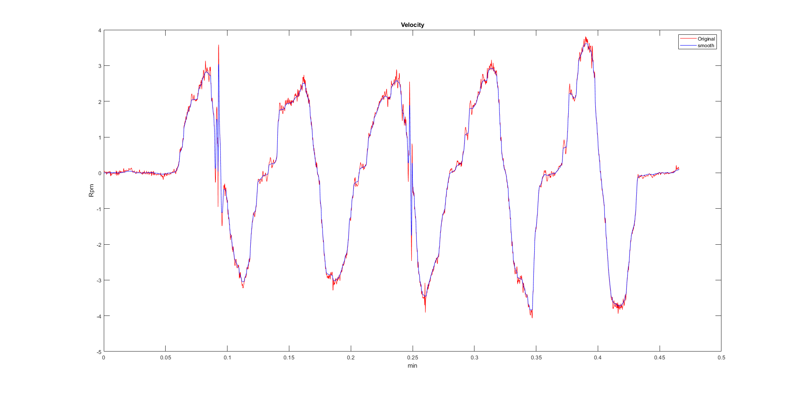
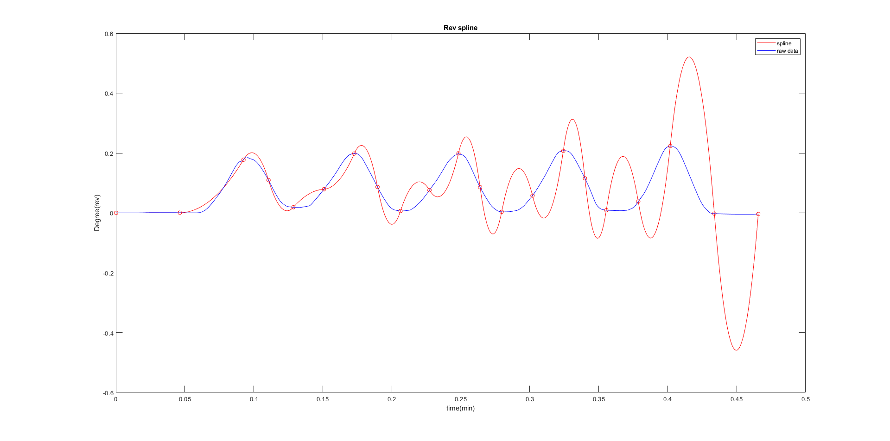
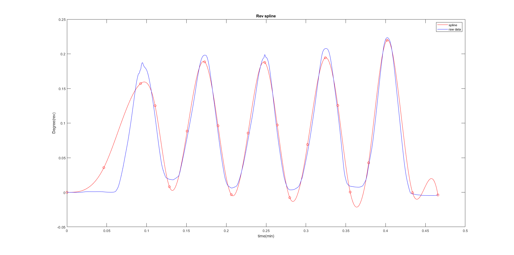

# Fiting_Curve
This code smoothed the trajectory curve to extract features from the motion trajectory.
We use Total Variation to smooth the track curve.

Then, using fmincon and the 3rd-order spline fitting curve, a parametric painting curve was found.

Before Iterative

After Iterative

